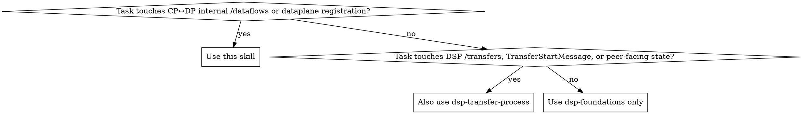

# Data Plane Signaling

## Purpose

Use this skill as the default reference for **Dataplane Signaling Protocol (DPS)** work in TRUE Connector.

Load `dsp-foundations` together with this skill. Also load `dsp-transfer-process` when the change touches DSP `/transfers` messages or control-plane state transitions visible to the remote connector.

Treat the upstream DPS specification as the **normative source** for DPS semantics:
- `https://eclipse-dataplane-signaling.github.io/dataplane-signaling/HEAD`
- `signaling-control-plane-openapi.yaml`
- `signaling-data-plane-openapi.yaml`

Treat these repository documents as the **source of current TRUE Connector reality**:
- `doc/data-plane-signaling-technical.md`
- `doc/data-plane-signaling-user-guide.md`
- `docs/superpowers/specs/2026-05-05-dataplane-signaling-design.md`
- `docs/superpowers/plans/2026-05-07-dataplane-signaling.md`
- `docs/superpowers/specs/2026-05-25-streaming-dataplane-design.md`
- `docs/superpowers/plans/2026-05-25-streaming-dataplane-implementation.md`

## When to Use

- A task touches CP↔DP `/dataflows/*` messaging
- A task adds or reviews a new dataplane module such as gRPC, Kafka, MQTT, S3, or another wire protocol
- A task changes dataplane registration, routing, callbacks, or `X-Api-Key` validation
- A task changes `DataFlow` state handling (`PREPARED`, `STARTED`, `SUSPENDED`, `COMPLETED`, `TERMINATED`)
- A task needs to distinguish **DPS internal CP↔DP protocol** from **DSP external connector↔connector protocol**
- A task investigates stuck transfers, callback failures, registration failures, or suspend/resume behavior

## Core Distinction

**DSP** governs connector-to-connector transfer control.

**DPS** governs control-plane-to-data-plane execution of the physical transfer.

Do not collapse them:
- DSP `TransferProcess` != DPS `DataFlow`
- DSP `TransferStartMessage` != DPS `DataFlowStartMessage`
- DSP states are the external contract with the remote connector
- DPS states are internal CP↔DP execution states

## Normative DPS Rules

### DataFlow state machine

The upstream DPS spec defines these `DataFlow` states:
- `INITIALIZED`
- `PREPARING`
- `PREPARED`
- `STARTING`
- `STARTED`
- `SUSPENDED`
- `COMPLETED`
- `TERMINATED`

Key rules:
- `prepare` transitions `INITIALIZED -> PREPARING` or `INITIALIZED -> PREPARED`
- `start` transitions `INITIALIZED -> STARTING` or `INITIALIZED -> STARTED`
- `PREPARED -> STARTING|STARTED` is valid
- `STARTED -> SUSPENDED|COMPLETED|TERMINATED` is valid
- `SUSPENDED -> STARTED|TERMINATED` is valid
- terminal states MUST NOT transition further
- `prepare` and `start` MAY be asynchronous and return `202 Accepted` + `Location`
- all other transitions are synchronous

### Normative control-plane DPS endpoints

The upstream control-plane OpenAPI defines:

| Endpoint | Purpose |
|---|---|
| `POST /transfers/{transferId}/dataflow/prepared` | DP signals `PREPARED` |
| `POST /transfers/{transferId}/dataflow/started` | DP signals `STARTED` |
| `POST /transfers/{transferId}/dataflow/completed` | DP signals `COMPLETED` |
| `POST /transfers/{transferId}/dataflow/errored` | DP signals unrecoverable wire error |
| `GET /transfers/{transferId}/agreement` | DP fetches transfer agreement |
| `PUT /dataplanes` + `DELETE /dataplanes` | OPTIONAL registration API; all-or-none if implemented |

Important rule:
- `errored` does **not** itself force a DSP state transition; the control plane decides recovery

### Normative data-plane DPS endpoints

The upstream data-plane OpenAPI defines:

| Endpoint | Purpose |
|---|---|
| `POST /dataflows/prepare` | prepare a data flow |
| `POST /dataflows/start` | provider-side start |
| `POST /dataflows/{id}/started` | notify consumer DP of started transfer |
| `POST /dataflows/{id}/suspend` | suspend |
| `POST /dataflows/{id}/resume` | resume |
| `POST /dataflows/{id}/terminate` | terminate |
| `GET /dataflows/{id}/status` | poll async status |

Important rule:
- `prepare` and `start` return `200` or `202`
- consumer-pull `started` notifications require a `DataAddress`
- provider-push `start` requests require a `DataAddress`

## TRUE Connector Current Reality

TRUE Connector already implements a practical DPS-style split, but not every endpoint currently matches upstream DPS 1:1.

### Current repository touchpoints

#### Data plane
- `data-plane/data-plane-api/src/main/java/it/eng/dataplane/api/spi/DataTransferProtocol.java`
- `data-plane/data-plane-api/src/main/java/it/eng/dataplane/api/message/DataFlowPrepareMessage.java`
- `data-plane/data-plane-api/src/main/java/it/eng/dataplane/api/message/DataFlowStartMessage.java`
- `data-plane/data-plane-api/src/main/java/it/eng/dataplane/api/message/DataFlowStatusMessage.java`
- `data-plane/data-plane-core/src/main/java/it/eng/dataplane/core/controller/DataFlowController.java`
- `data-plane/data-plane-core/src/main/java/it/eng/dataplane/core/service/DataFlowService.java`
- `data-plane/data-plane-core/src/main/java/it/eng/dataplane/core/client/ControlPlaneClient.java`
- `data-plane/data-plane-core/src/main/java/it/eng/dataplane/core/startup/ControlPlaneRegistrationBean.java`
- `data-plane/data-plane-core/src/main/java/it/eng/dataplane/core/DataPlaneApiEndpoints.java`
- `data-plane/data-plane-http-pull/.../HttpPullTransferProtocol.java`
- `data-plane/data-plane-http-push/.../HttpPushTransferProtocol.java`

#### Control plane
- `data-transfer/src/main/java/it/eng/datatransfer/client/DataPlaneClient.java`
- `data-transfer/src/main/java/it/eng/datatransfer/router/DataPlaneRouter.java`
- `data-transfer/src/main/java/it/eng/datatransfer/model/DataPlaneRegistration.java`
- `data-transfer/src/main/java/it/eng/datatransfer/service/DataPlaneRegistrationService.java`
- `data-transfer/src/main/java/it/eng/datatransfer/rest/api/DataFlowCallbackController.java`
- `data-transfer/src/main/java/it/eng/datatransfer/rest/api/DataPlaneRegistrationController.java`
- `data-transfer/src/main/java/it/eng/datatransfer/service/api/DataTransferAPIService.java`
- `data-transfer/src/main/java/it/eng/datatransfer/service/AbstractDataTransferService.java`
- `data-transfer/src/main/java/it/eng/datatransfer/service/AutomaticDataTransferService.java`

### Current endpoint reality in this repository

Current code uses these CP-facing paths:
- DP registration: `/api/v1/dataplanes`
- DP completion callback: `/api/v1/dataflows/complete`
- DP error callback: `/api/v1/dataflows/error`

Current `DataFlowController` exposes:
- `POST /dataflows/start`
- `POST /dataflows/prepare`
- `POST /dataflows/terminate/{processId}`
- `POST /dataflows/suspend/{processId}`

Review `DataPlaneClient` and `DataFlowController` together before changing lifecycle paths. The current code does not use the exact same terminate shape everywhere, so endpoint alignment is an explicit review point.

So when reviewing DPS work, always separate:
1. **upstream normative DPS endpoints**
2. **current TRUE Connector internal endpoint reality**
3. **planned alignment work**

Do not assume the current implementation already matches the latest upstream OpenAPI exactly.

## TRUE Connector Transfer Semantics

### HTTP-PULL

Current built-in flow:
- Provider CP generates the presigned S3 URL directly
- Consumer-side pull DP is the active dataplane
- artifact is stored in the consumer S3 bucket under `transferProcessId`

Key repository fact:
- provider-side pull DP is **not** required in the current built-in HTTP-PULL flow

### HTTP-PUSH

Current built-in flow:
- Consumer CP creates temporary S3 credentials
- Provider-side push DP downloads from provider S3 and uploads to consumer S3
- temp credentials are cleaned up after completion or termination

### Suspend limitation

Current repository constraint from `doc/data-plane-signaling-technical.md`:
- do **not** suspend once actual data movement has started
- `isDownloadInProgress=true` means suspend must be rejected
- otherwise the state machine can get stuck because a later completion callback would not fit the control-plane transition rules

## Registration and Security

### Registration

Current repository behavior:
- DPs self-register at startup using `ControlPlaneRegistrationBean`
- registration retries 5 times with exponential backoff
- blank `dataplane.control-plane-admin-endpoint` skips registration
- registrations are persisted on the CP in MongoDB
- current registration is idempotent by endpoint/id

### Authentication

Current repository behavior:
- CP↔DP calls use `X-Api-Key`
- `DataFlowCallbackController` validates callback API keys against registered dataplanes
- health endpoints are the usual exception

If you change registration or callback flows, inspect:
- `data-plane-core/.../ApiKeyAuthFilter.java`
- `data-plane-core/.../DataPlaneSecurityConfig.java`
- `data-transfer/.../DataFlowCallbackController.java`

## New Dataplane Modules

When implementing a new dataplane such as gRPC or Kafka:
- keep the control plane transport-agnostic
- implement the new transport as a separate dataplane module
- implement `DataTransferProtocol`
- let `DataTransferProtocolRegistry` discover it
- announce its supported transfer type(s) at registration
- keep source/sink backend logic separate from transport logic

For the current streaming roadmap, use:
- `docs/superpowers/specs/2026-05-25-streaming-dataplane-design.md`
- `docs/superpowers/plans/2026-05-25-streaming-dataplane-implementation.md`

That roadmap currently assumes:
- separate `data-plane-grpc` and `data-plane-kafka`
- `SourceReader` / `SinkWriter` abstractions
- `S3SourceReader` / `S3SinkWriter` as first implementations
- transport profile routing below DSP

## Implementation-Specific Decisions to Surface

Always call these out explicitly instead of presenting them as normative DPS rules:
- whether TRUE Connector is aligning to upstream DPS endpoints now or later
- whether `prepare` is actually used in the current built-in CP flow
- whether callback retry is implemented, best-effort, or missing
- how sticky routing works when a transfer must stay on one DP instance
- how resource cleanup works if `prepare` succeeds and `start` fails
- whether a new transport is push or pull from the DPS perspective
- how `DataAddress` fields map to the transport
- whether a transport supports finite, non-finite, suspend, and resume
- whether presigned URLs need refresh on resume

## Quick Reference

| Question | Check here first |
|---|---|
| Which CP/DP classes own DPS? | `DataPlaneClient`, `DataFlowController`, `DataFlowService`, `ControlPlaneClient` |
| Where do DPs register? | `ControlPlaneRegistrationBean`, `DataPlaneRegistrationController`, `DataPlaneRegistrationService` |
| Where are callback failures handled? | `ControlPlaneClient`, `DataFlowCallbackController` |
| Which built-in transports exist? | `HttpPullTransferProtocol`, `HttpPushTransferProtocol` |
| What is the current operator flow? | `doc/data-plane-signaling-user-guide.md` |
| What are the current internal endpoint paths? | `DataPlaneApiEndpoints`, `ApiEndpoints`, `DataFlowController` |
| What is the long-term streaming direction? | 2026-05-25 streaming design + implementation plan |

## Common Mistakes

### Mistake: treating DPS as if it were DSP
- **Fix:** keep `TransferProcess` and `DataFlow` separate in reasoning and code

### Mistake: inventing DPS fields in DSP messages
- **Fix:** transport-specific details belong in `DataAddress` or internal CP↔DP contracts, not in new DSP fields

### Mistake: assuming the current internal endpoints equal upstream DPS
- **Fix:** compare `DataFlowController` and `DataPlaneApiEndpoints` against the upstream OpenAPI before changing paths

### Mistake: reviewing only one side of a lifecycle call
- **Fix:** always inspect the CP caller and DP controller together, especially for terminate/suspend path alignment

### Mistake: assuming a callback error should always propagate to the remote connector
- **Fix:** upstream DPS says `errored` is a local control-plane recovery concern

### Mistake: suspending after data movement started
- **Fix:** check `isDownloadInProgress` semantics and the technical reference before changing suspend behavior

### Mistake: baking S3 assumptions into every new dataplane
- **Fix:** for new work, follow the streaming design and keep source/sink logic behind abstractions

## Output Expectations

When using this skill:

1. State whether the task affects **normative DPS semantics**, **current TRUE Connector DPS implementation**, or **planned DPS evolution**.
2. Point to the exact control-plane and data-plane touchpoints.
3. Call out any mismatch between upstream DPS and current repository behavior.
4. Identify implementation-specific decisions still open.
5. Recommend tests for registration, start/prepare flow, callback delivery, suspend/resume, and failure cleanup.
