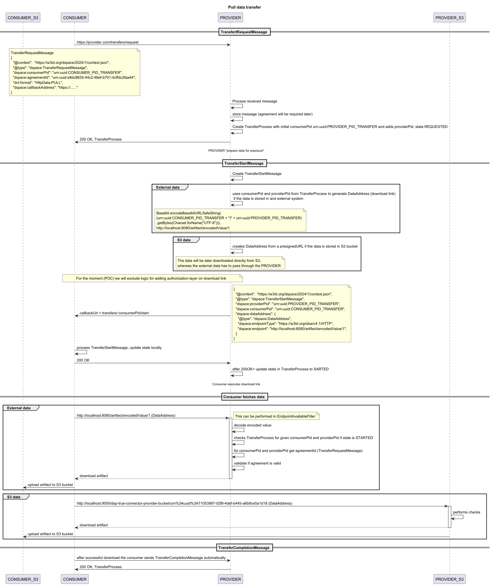
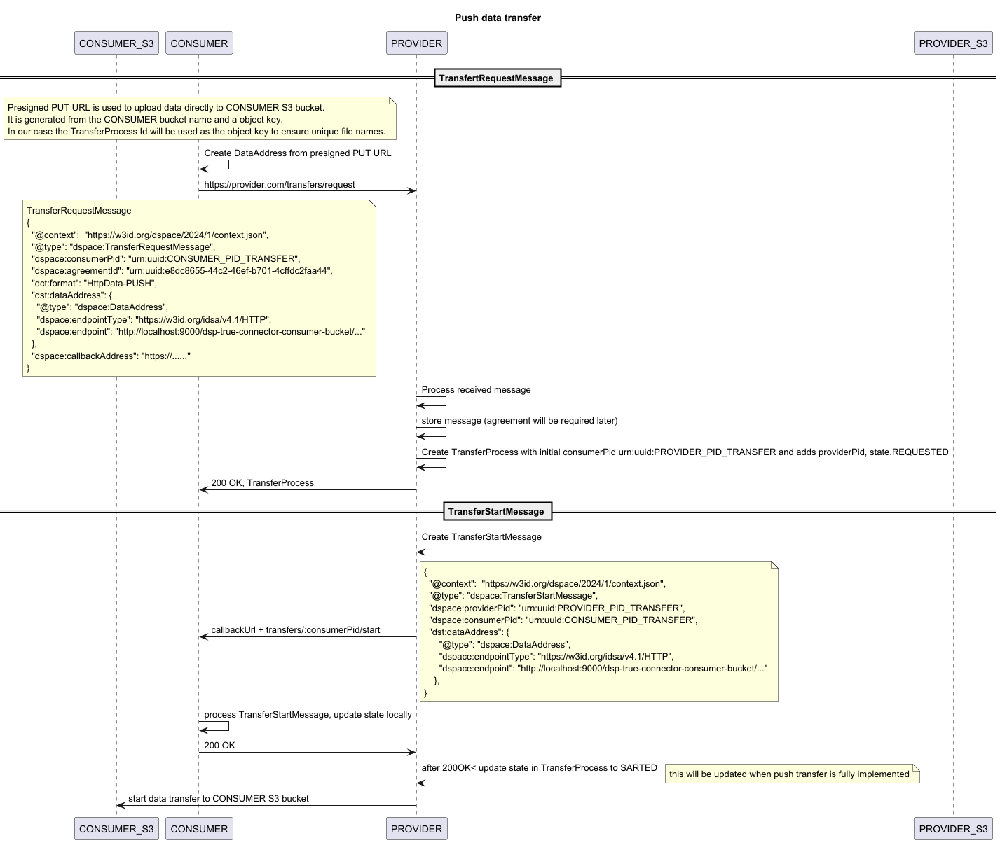

# Data Transfer
## Consumer initiates transfer

**Assumption:** contract negotiation is successfully completed between consumer and provider and agreement is stored.

Consumer initiates flow by sending TransferRequestMessage to provider endpoint http://localhost:8090/transfers/request:

```
{
"@context":  "https://w3id.org/dspace/2024/1/context.json",
"@type": "TransferRequestMessage",
"consumerPid": "urn:uuid:CONSUMER_PID_TRANSFER",
"agreementId": "urn:uuid:AGREEMENT_ID",
"dct:format": "HttpData-PULL",
"callbackAddress": "https://consumer.callback.url"
}
```
After processing message, (validate if such agreement exists), provider will create TransferProcess response and send it to consumer.

```
{
"@context":  "https://w3id.org/dspace/2024/1/context.json",
"@type": "TransferProcess",
"consumerPid": "urn:uuid:CONSUMER_PID_TRANSFER",
"providerPid": "urn:uuid:PROVIDER_PID_TRANSFER",
"state": "REQUESTED"
}
```
In case that agreement with such id is not found, provider will send TransferError message

```
{
"@context":  "https://w3id.org/dspace/2024/1/context.json",
"@type": "TransferError",
"consumerPid": "urn:uuid:CONSUMER_PID_TRANSFER",
"providerPid": "urn:uuid:PROVIDER_PID_TRANSFER",
"code": "...",
"reason": [
{},
{}
]
}
```
Internally, provider will store callbackAddress and agreementId into TransferProcess document. Those 2 fields will be used to send TransferStartMessage, to generate download link and enforce agreement, once download link is accessed, like

```
"transfer_process" : [
{
"_id": "abc45798-4444-4932-8baf-ab7fd66ql4d5",
"_class": "it.eng.datatransfer.model.TransferProcess",
"providerPid": "urn:uuid:PROVIDER_PID_TRANSFER",
"consumerPid": "urn:uuid:CONSUMER_PID_TRANSFER",
"callbackAddress" : "http://localhost:8080/consumer/transfer/callback/",
"agreementId" : "urn:uuid:AGREEMENT_ID",
"state" : "REQUESTEDs",
"createdBy": "admin@mail.com",
"lastModifiedBy": "admin@mail.com",
"issued": "2024-04-23T16:26:00.000Z",
"modified": "2024-04-23T16:26:00.000Z",
"version": 0
}
]
```

Here the path branches and depending on the data storage solution the DataAddress is different:
 - the data can be stored in a S3 bucket
 - the data can be stored using another external storage solution, in which case the DataAddress will contain the URL to that file in the external storage

## Http-PULL



Connector will generate a presignedURL(download link), in following format:

```
http://localhost:9000/dsp-true-connector-provider-bucket/urn%3Auuid%3A71053997-02f8-4def-b445-a6b9ce5a1d18?response-content-disposition=attachment%3B%20filename%3D%22ENG-employee.json

```

### Consumer triggers download

Upon initiating, the data will be directly downloaded from S3 bucket, using presigned URL. The consumer will receive the data and store it in S3.


## Http-PUSH



Connector acting as consumer will generate the DataAddress with S3 credentials that the connector acting as provider will use to upload the data in following format:

```
"dataAddress": {
    "endpointProperties": [
      {
        "name": "bucketName",
        "value": "dsp-true-connector-consumer"
      },
      {
        "name": "region",
        "value": "us-east-1"
      },
      {
        "name": "objectKey",
        "value": "urn:uuid:22644978-9b3d-4907-828f-7cb79d489996"
      },
      {
        "name": "accessKey",
        "value": "GetBucketUser-ece8f0de"
      },
      {
        "name": "secretKey",
        "value": "f0ca1d01-fd18-4168-b58a-81f6c1cf92dc"
      },
      {
        "name": "endpointOverride",
        "value": "http://localhost:9000"
      }
    ]
  }
```

### Provider triggers upload

Upon initiating, the data will be directly downloaded from S3 bucket, using presigned URL and then uploaded to the S3 bucket specified in the DataAddress.

## External storage

**NOTE** This solution downloads the data through the provider connector, which then forwards the data to the consumer. This is not a direct download from the external storage.

Connector exposes REST endpoint for "downloading" artifacts, in following format:

```
https://conenctor.provider:port/artifact/encoded(consumerPid|providerPid)/artifactId

```

Idea for this is that if single endpoint is exposed for all connectors, how could we know (at this stage, without credentials authorization) which connector is accessing data. In url we have "embedded" consumer and provider Pids, used to start transfer, and we can use them, to check if transferProcess is in started state, and to use consumerPid to get agreementId (TransferRequestMessage.agreementId) to fetch and enforce agreement.

describe logic with some example messages, so we might use them in req testing


Once resource is ready, can be done automatically or by enabling it from UI (user initiates sending TransferStartMessage, provider will perform following:

* for given consumerPid and providerPid from TransferProcess message, download link will be generated using:

```
String encoded = Base64.encodeBase64URLSafeString((transferProcess.consumer_pid + "|" + transferProcess.provider_pid).getBytes(Charset.forName("UTF-8")));
url = "/artifact/" + encoded + "/1"
```
* using callbackAddress from transferProcess, send request to consumer with link included

```
{
  "@context":  "https://w3id.org/dspace/2024/1/context.json",
  "@type": "TransferStartMessage",
  "providerPid": "urn:uuid:PROVIDER_PID_TRANSFER",
  "consumerPid": "urn:uuid:CONSUMER_PID_TRANSFER",  
  "dataAddress": {
    "@type": "DataAddress",
    "endpointType": "https://w3id.org/idsa/v4.1/HTTP",
    "endpoint": "http://localhost:8090/artifact/encoded_value/artifact_id",
  }
}

```

**Note** for this phase, authorization for downloading artifact is not implemented.

* upon receiving 200 OK from consumer, update TransferProcess.STATE to STARTED.

### Consumer triggers download link

Upon receiving request for artifact, provider will initiate filter, to validate following:

* if link needs to be validated (link contains '/artifact/')
* if link is download link, get consumerPid and providerPid from url (parse url and decode values)
* get agreementId for consumerPid:providerPid combination (from TransferProcess document)
* if agreementId is found, trigger agreement enforcement

If all steps are evaluated as true, in that case provider connector will allow request to be executed, otherwise it will return http 503 status, saying service not available.

Controller that handles artifacts will fetch correct artifact based on artifactId passed and sends response back to the consumer.

For testing, with initial data present in 


"providerPid": "urn:uuid:PROVIDER_PID_TRANSFER",
"consumerPid": "urn:uuid:CONSUMER_PID_TRANSFER",  

```
http://localhost:8090/artifact/dXJuOnV1aWQ6Q09OU1VNRVJfUElEX1RSQU5TRkVSfHVybjp1dWlkOlBST1ZJREVSX1BJRF9UUkFOU0ZFUg/1
```

and not available - HTTP 503:

"providerPid": "urn:uuid:PROVIDER_PID_TRANSFER",
"consumerPid": "urn:uuid:CONSUMER_PID_TRANSFER_NOT",  

```
http://localhost:8090/artifact/dXJuOnV1aWQ6Q09OU1VNRVJfUElEX1RSQU5TRkVSfHVybjp1dWlkOlBST1ZJREVSX1BJRF9UUkFOU0ZFUl9OT1Q/1
```

TODO:
 
 * add authorization logic for data endpoint - we might then have endpoint without encoded part; then we need to add creating credentials, storing credentials and checking then when consumer "clicks" download link.