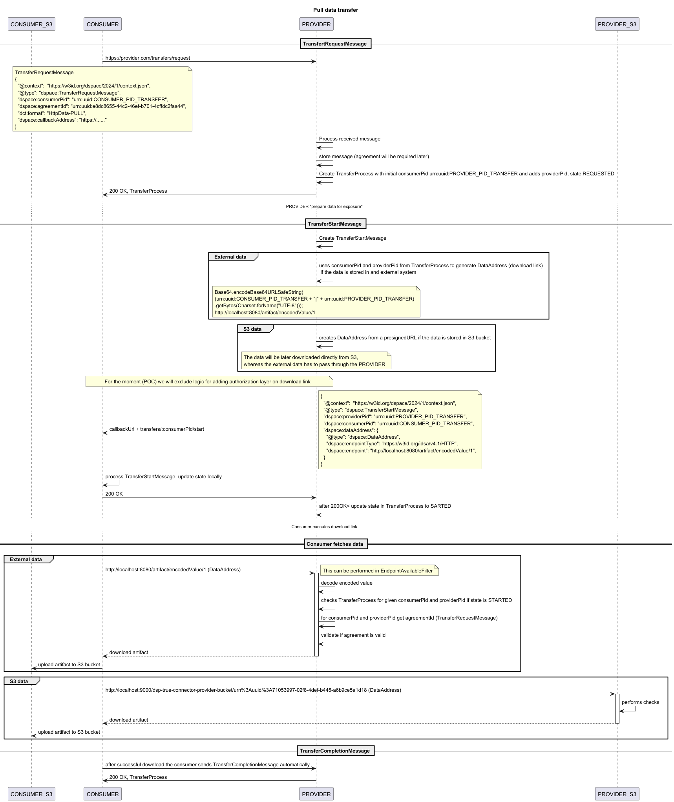
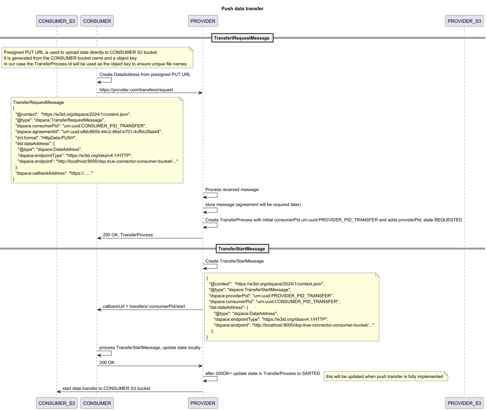

# Data Transfer — User Guide

> **See also:** [Technical Documentation](./data-transfer-technical.md) | [SFTP Configuration](./sftp.md) | [Contract Negotiation](../../connector/doc/negotiation.md) | [Data Transfer Plane](../../connector/doc/transfer.md)

## What is Data Transfer?

Data Transfer is the mechanism by which a consumer connector retrieves data from a provider connector in a governed, auditable way. Once a contract negotiation is successfully completed and an agreement is stored, the consumer can initiate a transfer. The connector enforces the agreement at every step: before starting, before serving data, and on each access.

**Prerequisite:** A contract negotiation must be successfully completed and its agreement stored in both connectors before initiating any transfer.

---

## Transfer Methods

### HTTP-PULL

The provider generates a time-limited download link (presigned URL) for the artifact in its S3 bucket, or an endpoint URL for external artifacts. This link is sent to the consumer in the `TransferStartMessage`. The consumer then fetches the data using that link and stores it in its own S3 bucket.

**Use when:** The consumer wants to pull data from the provider on demand.

Flow summary:
1. Consumer sends `TransferRequestMessage` with format `HttpData-PULL`
2. Provider generates download link, sends it in `TransferStartMessage`
3. Consumer downloads from the link and stores data locally

### HTTP-PUSH

The consumer provides its S3 bucket credentials in the transfer request. The provider downloads the artifact from its own S3 storage and uploads it directly into the consumer's S3 bucket.

**Use when:** The consumer wants the provider to push data into the consumer's storage automatically.

Flow summary:
1. Consumer sends `TransferRequestMessage` with format `HttpData-PUSH` and S3 credentials
2. Provider starts transfer, downloads artifact, uploads to consumer S3
3. Provider sends `TransferCompletionMessage` when done

### External Storage (REST Artifact Endpoint)

When the artifact is stored in an external system (not S3), the provider exposes a REST endpoint. When the consumer accesses this endpoint, the provider validates the transfer state and agreement, then fetches the data from the external source and streams it to the consumer.

**Note:** Data flows through the provider connector — this is not a direct download from the external storage.

---

## How Data Transfer Works

### Step 1: Consumer Initiates Transfer

The consumer sends a `TransferRequestMessage` to the provider's endpoint:

```
POST http://provider-connector:port/transfers/request
```

```json
{
  "@context": "https://w3id.org/dspace/2024/1/context.json",
  "@type": "TransferRequestMessage",
  "consumerPid": "urn:uuid:CONSUMER_PID_TRANSFER",
  "agreementId": "urn:uuid:AGREEMENT_ID",
  "dct:format": "HttpData-PULL",
  "callbackAddress": "https://consumer.callback.url"
}
```

Alternatively, use the management API to initiate from the consumer side:

```
POST /api/v1/transfers
```

```json
{
  "transferProcessId": "internal-transfer-process-id",
  "format": "HttpData-PULL"
}
```

**What happens next:**
- The provider validates that the agreement exists and the requested format is supported
- The provider stores the `callbackAddress` and `agreementId` in its `TransferProcess` record
- The provider responds with a `TransferProcess` in `REQUESTED` state

**Success response:**
```json
{
  "@context": "https://w3id.org/dspace/2024/1/context.json",
  "@type": "TransferProcess",
  "consumerPid": "urn:uuid:CONSUMER_PID_TRANSFER",
  "providerPid": "urn:uuid:PROVIDER_PID_TRANSFER",
  "state": "REQUESTED"
}
```

**Error response (agreement not found):**
```json
{
  "@context": "https://w3id.org/dspace/2024/1/context.json",
  "@type": "TransferError",
  "consumerPid": "urn:uuid:CONSUMER_PID_TRANSFER",
  "providerPid": "urn:uuid:PROVIDER_PID_TRANSFER",
  "code": "...",
  "reason": []
}
```

### Step 2: Provider Starts Transfer

Once the resource is ready, the provider sends a `TransferStartMessage` to the consumer's callback address. This can happen automatically (if `application.automatic.transfer=true`) or manually via the management API:

```
PUT /api/v1/transfers/{transferProcessId}/start
```

For **HTTP-PULL**, the provider generates a presigned download URL:
```
http://localhost:9000/dsp-true-connector-provider-bucket/urn%3Auuid%3A71053997-02f8-4def-b445-a6b9ce5a1d18?response-content-disposition=attachment%3B%20filename%3D%22data.json
```

For **External Storage**, the provider generates an encoded artifact URL:
```java
// Provider-side URL construction:
String encoded = Base64.encodeBase64URLSafeString(
    (consumerPid + "|" + providerPid).getBytes("UTF-8")
);
String url = "/artifacts/" + encoded;
```

The `TransferStartMessage` sent to the consumer callback:
```json
{
  "@context": "https://w3id.org/dspace/2024/1/context.json",
  "@type": "TransferStartMessage",
  "providerPid": "urn:uuid:PROVIDER_PID_TRANSFER",
  "consumerPid": "urn:uuid:CONSUMER_PID_TRANSFER",
  "dataAddress": {
    "@type": "DataAddress",
    "endpointType": "https://w3id.org/idsa/v4.1/HTTP",
    "endpoint": "http://provider-connector:8090/artifacts/BASE64_ENCODED_PIDS"
  }
}
```

Upon receiving a `200 OK` from the consumer, the provider transitions the `TransferProcess` to `STARTED`.

### Step 3: Consumer Downloads or Receives Data

**For HTTP-PULL:**

Trigger download via the management API:
```
GET /api/v1/transfers/{transferProcessId}/download
```

The consumer fetches the presigned URL from the `TransferStartMessage.dataAddress.endpoint`, downloads the data, and stores it in its local S3 bucket. A `TransferCompletionMessage` is sent automatically on success.

Once completed, view the downloaded data:
```
GET /api/v1/transfers/{transferProcessId}/view
```
Returns a 7-day presigned S3 URL for accessing the locally stored data.

**For HTTP-PUSH:**

No consumer action required. The provider downloads the artifact from its S3 bucket and uploads directly to the consumer's S3 bucket (specified in the `DataAddress` from Step 1). The provider sends `TransferCompletionMessage` when done.

**For External Storage:**

The consumer accesses the artifact URL received in `TransferStartMessage.dataAddress.endpoint`. The provider validates the transfer state and agreement, then proxies the data from the external source.

Example URL format:
```
http://provider-connector:8090/artifacts/dXJuOnV1aWQ6Q09OU1VNRVJfUElEX1RSQU5TRkVSfHVybjp1dWlkOlBST1ZJREVSX1BJRF9UUkFOU0ZFUg
```

If the transfer is not in `STARTED` state, the endpoint returns HTTP 503.

---

## Transfer States

| State | Meaning |
|-------|---------|
| `INITIALIZED` | Transfer process pre-created by provider (before consumer requests) |
| `REQUESTED` | Consumer has sent the transfer request; provider has acknowledged it |
| `STARTED` | Transfer is active; data is accessible or being transferred |
| `SUSPENDED` | Transfer has been paused by either party |
| `COMPLETED` | Transfer finished successfully; data is available to consumer |
| `TERMINATED` | Transfer was stopped (by either party, or after retry exhaustion) |

`COMPLETED` and `TERMINATED` are terminal states — no further transitions are possible.

---

## S3 Configuration for HTTP-PUSH

For `HttpData-PUSH`, the consumer must provide S3 credentials so the provider can upload data directly. When using the management API (`POST /api/v1/transfers`), the credentials are automatically retrieved from the consumer connector's configured bucket credentials — no manual configuration is needed.

If sending the `TransferRequestMessage` directly (protocol-level), include the `dataAddress`:

```json
{
  "@context": "https://w3id.org/dspace/2024/1/context.json",
  "@type": "TransferRequestMessage",
  "consumerPid": "urn:uuid:CONSUMER_PID_TRANSFER",
  "agreementId": "urn:uuid:AGREEMENT_ID",
  "dct:format": "HttpData-PUSH",
  "callbackAddress": "https://consumer.callback.url",
  "dataAddress": {
    "endpointProperties": [
      { "name": "bucketName",       "value": "dsp-true-connector-consumer" },
      { "name": "region",           "value": "us-east-1" },
      { "name": "objectKey",        "value": "urn:uuid:22644978-9b3d-4907-828f-7cb79d489996" },
      { "name": "accessKey",        "value": "GetBucketUser-ece8f0de" },
      { "name": "secretKey",        "value": "f0ca1d01-fd18-4168-b58a-81f6c1cf92dc" },
      { "name": "endpointOverride", "value": "http://localhost:9000" }
    ]
  }
}
```

---

## Example Transfers

### HTTP-PULL Example



**1. Consumer initiates transfer (management API):**
```bash
curl -X POST http://consumer-connector:8080/api/v1/transfers \
  -H "Content-Type: application/json" \
  -u admin:password \
  -d '{
    "transferProcessId": "internal-transfer-process-id",
    "format": "HttpData-PULL"
  }'
```

**2. Provider starts transfer (management API on provider):**
```bash
curl -X PUT http://provider-connector:8090/api/v1/transfers/{transferProcessId}/start \
  -u admin:password
```

**3. Consumer downloads data:**
```bash
curl -X GET http://consumer-connector:8080/api/v1/transfers/{transferProcessId}/download \
  -u admin:password
```

**4. Consumer views downloaded artifact (returns presigned URL):**
```bash
curl -X GET http://consumer-connector:8080/api/v1/transfers/{transferProcessId}/view \
  -u admin:password
```

### HTTP-PUSH Example



**1. Consumer initiates push transfer (management API — credentials are auto-populated):**
```bash
curl -X POST http://consumer-connector:8080/api/v1/transfers \
  -H "Content-Type: application/json" \
  -u admin:password \
  -d '{
    "transferProcessId": "internal-transfer-process-id",
    "format": "HttpData-PUSH"
  }'
```

**2. Provider starts transfer (management API on provider — triggers upload automatically):**
```bash
curl -X PUT http://provider-connector:8090/api/v1/transfers/{transferProcessId}/start \
  -u admin:password
```

The provider will upload the data to the consumer's S3 bucket and send `TransferCompletionMessage` automatically.

---

## Automatic Transfer

When `application.automatic.transfer=true` is configured, the connector automatically progresses through transfer phases without manual intervention:

- **Provider:** After receiving `TransferRequestMessage`, automatically sends `TransferStartMessage`
- **Consumer (HTTP-PULL):** After receiving `TransferStartMessage`, automatically downloads the data
- **HTTP-PUSH provider:** After the start is acknowledged, automatically uploads the data and completes

Failed attempts are retried according to `application.automatic.transfer.retry.max` (default: 3) with `application.automatic.transfer.retry.delay.ms` (default: 2000 ms) between attempts. After all retries are exhausted, the transfer is terminated.

---

## Troubleshooting

| Problem | Likely Cause | Solution |
|---------|-------------|----------|
| `TransferError` on request | Agreement ID not found, or contract negotiation not finalized | Verify the `agreementId` matches a completed negotiation |
| `400 Bad Request` on request | Requested format not supported by the dataset's distribution | Check the dataset's supported formats in the catalog |
| `TransferProcessInvalidStateException` | Attempting an invalid state transition (e.g. COMPLETED → STARTED) | Check the current state; `COMPLETED` and `TERMINATED` are terminal |
| Provider cannot upload (HTTP-PUSH) | Incorrect S3 credentials, wrong bucket name, or unreachable endpoint | Verify `bucketName`, `accessKey`, `secretKey`, and `endpointOverride` in the `dataAddress` |
| `/artifacts/{transactionId}` returns HTTP 503 | Transfer process not in `STARTED` state, or wrong PIDs encoded | Confirm transfer is in `STARTED` state; recheck Base64url encoding of `consumerPid|providerPid` |
| `downloadData` fails | Transfer process not in `STARTED` state | Ensure the provider has sent `TransferStartMessage` and state is `STARTED` |
| `viewData` returns error | Transfer not in `COMPLETED` state, or data not found in S3 | Complete the download first via `GET /api/v1/transfers/{id}/download` |

---

## See Also

- [Technical Documentation](./data-transfer-technical.md) — architecture, all APIs, state machine details, service descriptions
- [SFTP Configuration](./sftp.md) — SFTP transfer setup
- [Contract Negotiation](../../connector/doc/negotiation.md) — prerequisite for data transfer
- [Data Transfer Plane](../../connector/doc/transfer.md)