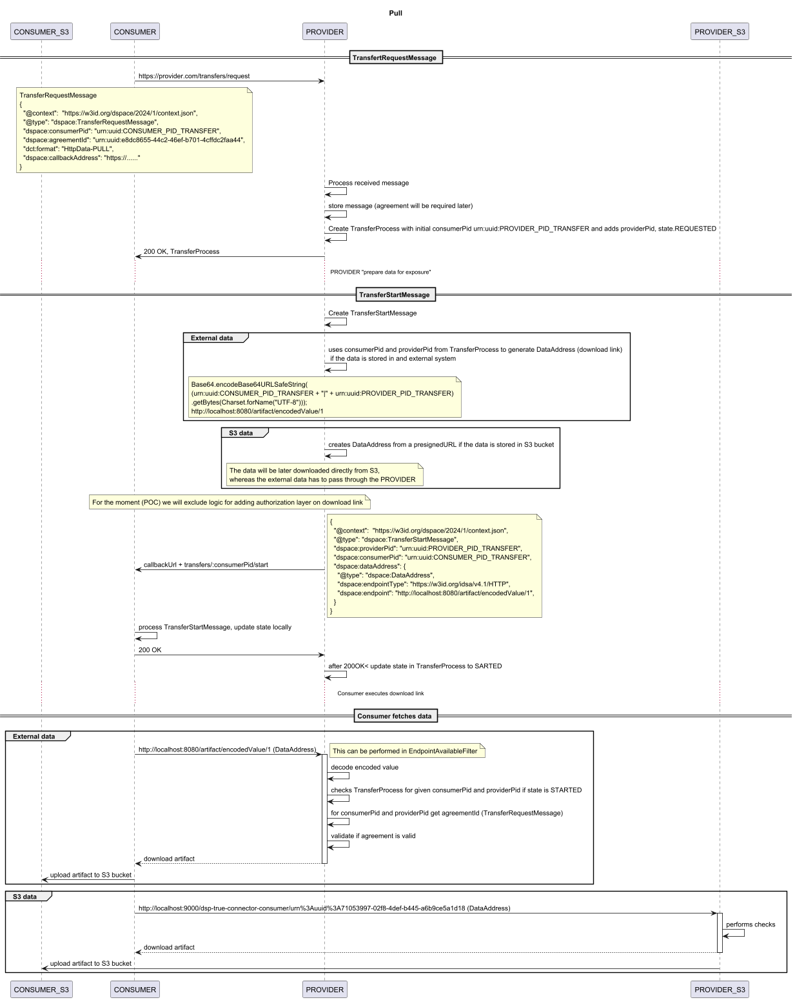

# REST Pull 

Connector exposes rest endpoint for "downloading" artifacts, in following format:

```
https://conenctor.provider:port/artifact/encoded(consumerPid|providerPid)/artifactId

```

More details about the flow can be found [here](diagrams/transfer.uml)

.

