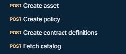
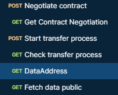
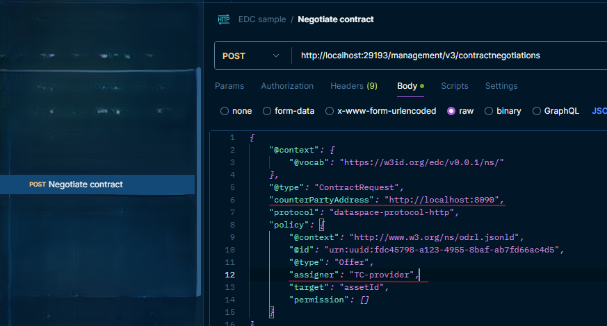

# EDC testing

This is a guide on how to start the EDC Samples, preparation for communication, requests for testing, and obstacles that we have encountered.

## EDC Samples start

First download the samples from [the EDC samples repository](https://github.com/eclipse-edc/Samples/tree/main).

To run the provider, just run the following command:

```
java -Dedc.keystore=transfer/transfer-00-prerequisites/resources/certs/cert.pfx -Dedc.keystore.password=123456 -Dedc.fs.config=transfer/transfer-00-prerequisites/resources/configuration/provider-configuration.properties -jar transfer/transfer-00-prerequisites/connector/build/libs/connector.jar
```

To run the consumer, just run the following command (different terminal):

```
java -Dedc.keystore=transfer/transfer-00-prerequisites/resources/certs/cert.pfx -Dedc.keystore.password=123456 -Dedc.fs.config=transfer/transfer-00-prerequisites/resources/configuration/consumer-configuration.properties -jar transfer/transfer-00-prerequisites/connector/build/libs/connector.jar
```

## EDC Samples preparation and communication

You can use this [EDC Postman collection](edc-sample.postman_collection.json) for the requests. If you run the whole collection set a delay of 2 seconds between requests.

The first 4 requests add an asset to the provider:<br/>


The rest are for the negotiation and data transfer:<br/>


## TC preparation

EDC is using a custom authentication method so for the testing we have to turn off our authorization. Edit property file and set following property like:

```
application.protocol.authentication.enabled=false
```

Since EDC have the authorization enabled we have to change the following in the class it.eng.tools.util.CredentialUtils:

```
public String getConnectorCredentials() {
		// TODO replace with Daps JWT
//		return  okhttp3.Credentials.basic("connector@mail.com", "password");
		return "{\"region\":\"eu\",\"audience\":\"http://localhost:8090\",\"clientId\":\"TC-provider\"}";
	}
```

audience - is the TC connector - the values is passed from  "counterPartyAddress": "http&#65279;://localhost:8090" in EDC requests
clientId - this value must the same as "assigner": "TC-provider" in EDC requests <br/>




Open the initial_data.json and remove the permission, to do so replacing the following:

```
 "hasPolicy": [{
                    "_id": "urn:uuid:fdc45798-a123-4955-8baf-ab7fd66ac4d5",
                    "_class": "it.eng.catalog.model.Offer",
                    "permission": [{
							"target": "urn:uuid:TARGET",
                            "action": "USE",
                            "constraint": [{
                                    "leftOperand": "COUNT",
                                    "operator": "EQ",
                                    "rightOperand": "5"
                                }
                            ]
                        }
                    ]
                }
            ],
```

With the code bellow:

```
 "hasPolicy": [{
                    "_id": "urn:uuid:fdc45798-a123-4955-8baf-ab7fd66ac4d5",
                    "_class": "it.eng.catalog.model.Offer",
                    "permission": []
                }
            ],
```


## TC-EDC communication

In this section we are going to go through the contract negotiation between TC and EDC. Please use the TC postman collection for the TC request in conjunction with the information provided in this guide.

### TC consumer - EDC provider

To continue with this section you had to first insert the asset in EDC. EDC will respond automatically to our requests so we will be sending requests only from TC.

Use the TC Start negotiation Postman request and change the body with this:

```
{
    "Forward-To": "http://localhost:19194/protocol",
    "offer": {
        "@id": "MQ==:YXNzZXRJZA==:YTM3ZTM3ODktY2VmZi00NTYzLWE5M2MtNjY3NGY5Mjk1YmY1",
        "target": {
            "@id": "assetId"
        },
        "assigner": "provider",
        "permission": []
    }
}
```

The permission must be an empty array. If the array would have 1 Permission EDC will send a single Object, not an Array of one (we support only array).

Finally, send the Verify negotiation request as is.

### TC provider - EDC consumer

To start the contract negotiation TC provider - EDC consumer start with the EDC request Negotiate contract and insert following body:

```
{
  "@context": {
    "@vocab": "https://w3id.org/edc/v0.0.1/ns/"
  },
  "@type": "ContractRequest",
  "counterPartyAddress": "http://localhost:8090",
  "protocol": "dataspace-protocol-http",
  "policy": {
    "@context": "http://www.w3.org/ns/odrl.jsonld",
    "@id": "urn:uuid:fdc45798-a123-4955-8baf-ab7fd66ac4d5",
    "@type": "Offer",
    "assigner": "TC-provider",
    "target": "assetId"
  }
}
```

Afterwards use Find Contract Negotiation, Approve negotiation and Finalize negotiation requests from TC in that order, no changes needed.

## Notes

During the testing and integration we have noticed the following:

- dpsace value "https&#65279;://w3id.org/dspace/v0.8/" instead "https&#65279;://w3id.org/dspace/1/0/context.json"
- Constraint.leftOperand, Constraint.operator, Permission.target, Permission.action, ContractNegotiationEventMessage.eventType are now objects
(they can be String or as Reference, json object with @id as key and String for value)
 
```
"odrl:leftOperand": {
	"@id": "odrl:count"
},
"odrl:operator": {
	"@id": "odrl:eq"
}
 
"odrl:target": {
	"@id": "assetId"
}
```

- dct:format - "HttpData-PULL" and "HttpData-PUSH"
- ContractNegotiationConsumerService - callbackAddress might be omitted in ContractAgreementMessage, in that case we will use initial "Forward-To" as callbackAddress
- EDC expects Authorization header like this {\"region\":\"eu\",\"audience\":\"http&#65279;://localhost:8090\",\"clientId\":\"TC-provider\"}
- until this moment we did not find in EDC documentation how to customize authorization on receiver side and on sender side
- if the array would have 1 Permission EDC will send a single Object, not an Array of one (we support only array)