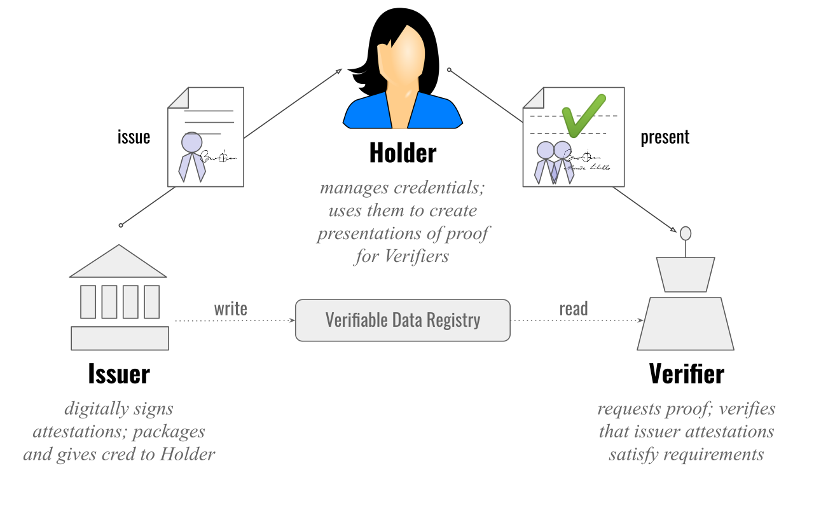

# DID, DID documents and Verifiable credentials

## Table of Contents

- [DID *D*ecentralized *ID*entifier](#did)
	- [DID method](#did-method)
	- [DID Specific String](#did-specific-string)
		- [Path](#did-path)
		- [Query](#did-query)
		- [Fragment](#did-fragment)
- [DID documents](#did-documents)
- [DID methods](#did-methods)
- [Verifiable credential](#verifiable-credential)


## [DID *D*ecentralized *ID*entifier](https://www.w3.org/TR/did-1.0/) <a name="did"></a>

A decentralized identifier (DID) is a type of globally unique identifier that enables an entity to be identified in a manner that is verifiable, persistent (as long as the DID controller desires), and does not require the use of a centralized registry

Requirements for DID:

 - Permanent - should not change in future
 - Resolvable -> to some metadata (public key and other data)
 - Cryptographically verifiable - proof that we are the owner of the document
 - Decentralized
 
DID consists of following parts:

did:{did-method}:{did-specific-string}[ "?" query ] [ "#" fragment ]


### DID method <a name="did-method"></a>

A DID method is defined by a DID method specification, which specifies the precise operations by which DIDs and DID documents are created, resolved, updated, and deactivated.

### DID Specific String <a name="did-specific-string"></a>

For simplicity we are assuming that did method is web.

#### Path <a name="did-path"></a>

did:web:host_name/path

#### Query <a name="did-query"></a>

did:web:host_name?versionId=1

#### Fragment <a name="did-fragment"></a>

did:web:host_name#key-1

Fragment use case will be most likely used in DSP usecases, referring to public keys from did document which needs to be used in verification method, in this case key with id: key-1

 
## [DID documents] <a name="did-documents"></a>

A decentralized identifier resolves (points) to a DID document, a set of data describing the DID subject, including mechanisms, such as cryptographic public keys, that the DID subject or a DID delegate can use to authenticate itself and prove its association with the DID. 

## DID methods <a name="did-methods"></a>

Just as there are many different types of URIs, all of which conform to the URI standard, there are many different types of DID methods, all of which must conform to the DID standard. Each DID method specification must define:

The name of the DID method (which must appear between the first and second colon, e.g., did:example:).
The structure of the unique identifier that must follow the second colon.

Example:

did:web:dataspace-issuer

Meaning that this did (id - dataspace-issuer) should be resolved using web and that did document should be located in http(s)://dataspace-issuer/.well-known/did.json

like following:

```
{
	"service": [],
	"verificationMethod": [
		{
			"id": "did:web:dataspace-issuer#key-1",
			"type": "JsonWebKey2020",
			"controller": "did:web:dataspace-issuer",
			"publicKeyMultibase": null,
			"publicKeyJwk": {
				"kty": "OKP",
				"crv": "Ed25519",
				"x": "Hsq2QXPbbsU7j6JwXstbpxGSgliI04g_fU3z2nwkuVc"
			}
		}
	],
	"authentication": [
		"key-1"
	],
	"id": "did:web:dataspace-issuer",
	"@context": [
		"https://www.w3.org/ns/did/v1",
		{
			"@base": "did:web:dataspace-issuer"
		}
	]
}
```

## [Verifiable credential](https://www.w3.org/TR/vc-overview/) <a name="verifiable-credential"></a>


Verifiable credentials (VCs) are digital credentials which follow the relevant World Wide Web Consortium open standards. They can represent information found in physical credentials, such as a passport or license, as well as new things that have no physical equivalent, such as ownership of a bank account. 

Verifiable credentials can be issued by anyone, about anything, and can be presented to and verified by everyone. The entity that generates the credential is called the Issuer. The credential is then given to the Holder who stores it for later use. The Holder can then prove something about themselves by presenting their credentials to a Verifier.

Additional information with examples can be found [here](https://www.w3.org/TR/vc-data-model/)

Triangle of trust:



 - Issuer creates did and publish did document (issuer public key) to data registry
 
 - Holder requests some credentials from issuer
 - Issuer creates credentials with following:

 ```
 issuer: issuer-did
 subject: holder-did
 claim1
 claim2
 ...
 sign with issuer private key
```

 - Holder receives VC and store it in it's wallet
 
 - Holder creates verifiable presentation (easiest use case that it takes VC received from Issuer, and sign it with its private key)
 
 ```
 issuer: holder-did
 subject: verifier
 claim: VC from issuer
 sign: holder private key
 ```
 
 - Verifier receives request
 - Verifier resolves "outer" did, issuer -> holder-did and verify holder signature
 - Verifier checks "internal" VC and resolves issuer as issuer-did 
 
 In case of resolving did, simple use case is that each time it will be web resolver. In that case did.json document must be available on service/.well-known/did.json
